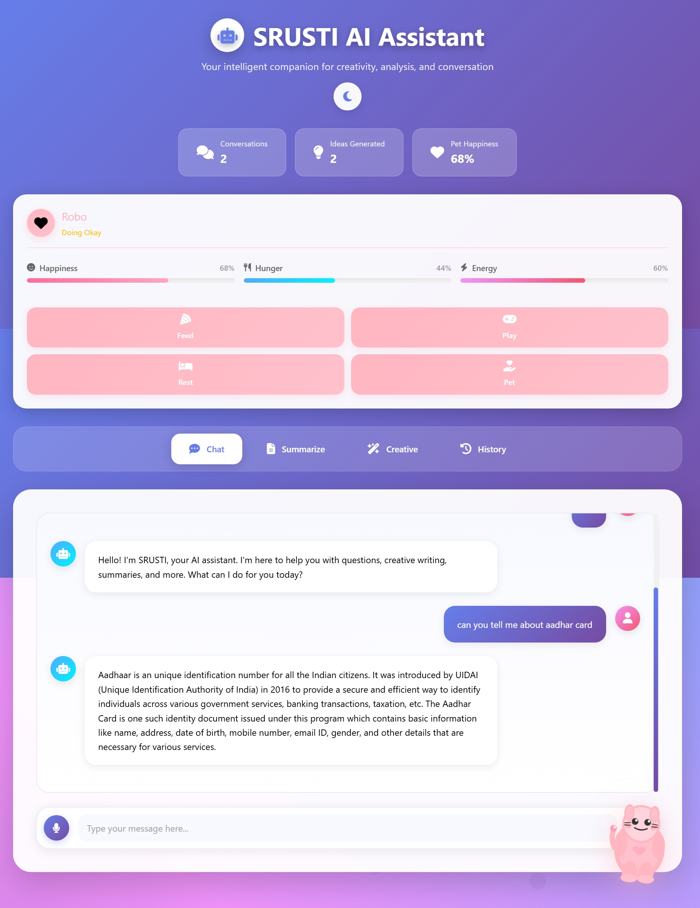
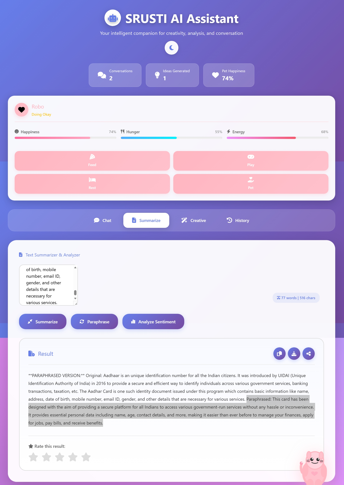
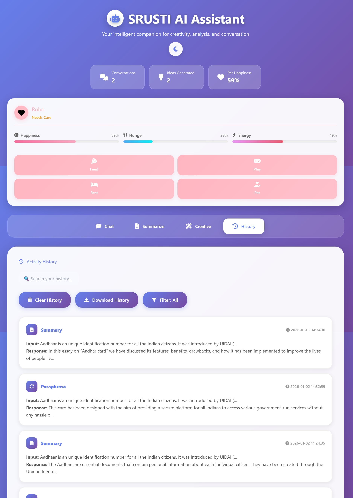

# SRUSTI AI Assistant

Flask-based AI assistant with TinyLlama backend, smart API fallbacks, and comprehensive features.


## 🚀 Features



### Core AI Capabilities
- **Question Answering** - Comprehensive answers to any question
- **Creative Writing** - Complete stories, poems, essays
- **Text Summarization** - Detailed summaries without limits
- **Paraphrasing** - Full text rephrasing
- **Sentiment Analysis** - VADER + TextBlob analysis

.jpeg)

### Smart API Integration
- **Multi-API Fallback** - Groq → Ollama → HuggingFace → Local
- **Instant Responses** - 2-3 seconds with API keys
- **Offline Capable** - Works without internet
- **Production Ready** - Comprehensive error handling



## 📊 Performance

| Feature | Response Time | Quality |
|---------|---------------|---------|
| Groq API | 2-3 seconds | ⭐⭐⭐⭐⭐ |
| Ollama Local | 3-5 seconds | ⭐⭐⭐⭐⭐ |
| HuggingFace | 5-10 seconds | ⭐⭐⭐⭐ |
| Local TinyLlama | 20-30 seconds | ⭐⭐⭐⭐ |

## 🛠️ Quick Setup

### Prerequisites
- Python 3.9+
- 4GB+ RAM
- Git

### Installation
```bash
git clone https://github.com/yourusername/srusti-ai-assistant.git
cd srusti-ai-assistant
pip install -r requirements.txt

# Set up environment variables
cp .env.example .env
# Edit .env and add your API keys
```

### Configuration
1. Copy `.env` file and add your API keys:
   ```bash
   GROQ_API_KEY=your_actual_groq_api_key
   SECRET_KEY=your_secure_random_key
   ```

2. Run the application:
   ```bash
   python app.py
   ```

Access at: http://localhost:5000

.jpeg)

### Optional: Fast API Setup
```bash
# Groq (Fastest - 2-3 seconds)
export GROQ_API_KEY=your_key_here

# Ollama (Local - 3-5 seconds)
ollama pull llama3.2:1b
ollama serve
```

## 📁 Project Structure

```
srusti-ai-assistant/
├── app.py                 # Main Flask application
├── requirements.txt       # Dependencies
├── README.md             # This file
├── LICENSE               # MIT License
├── .gitignore           # Git ignore rules
├── Procfile             # Heroku deployment
├── runtime.txt          # Python version
├── deploy.sh            # Deployment script
├── templates/
│   └── index.html       # Web interface
├── static/
│   └── voice-fallback.js
├── images/              # README screenshots
└── .github/
    └── workflows/
        └── deploy.yml   # CI/CD pipeline
```

## 🚢 Deployment Options

### Heroku
```bash
heroku create your-app-name
heroku config:set GROQ_API_KEY=your_groq_api_key
heroku config:set SECRET_KEY=your_secure_secret_key
git push heroku main
```

### Railway/Render
- Connect GitHub repository
- Set environment variables in dashboard:
  - `GROQ_API_KEY`
  - `SECRET_KEY`
- Auto-deploy on push

### Local Production
```bash
gunicorn -w 4 -b 0.0.0.0:5000 app:app
```



## 🔧 Configuration

### Environment Variables
```bash
SECRET_KEY=your-secret-key
GROQ_API_KEY=your-groq-key
HF_API_KEY=your-huggingface-token
```

## 📈 API Endpoints

| Method | Endpoint | Description |
|--------|----------|-------------|
| GET | `/` | Main interface |
| POST | `/generate` | Generate responses |
| POST | `/paraphrase` | Paraphrase text |
| POST | `/sentiment` | Analyze sentiment |
| POST | `/export_pdf` | Export as PDF |
| GET | `/health` | Health check |

## 🔒 Security Features

- Input validation and sanitization
- Rate limiting ready
- Error handling without data exposure
- Secure session management
- Environment-based configuration

## 📝 License

MIT License - see [LICENSE](LICENSE) file.

## 🤝 Contributing

1. Fork the repository
2. Create feature branch
3. Commit changes
4. Push to branch
5. Create Pull Request

---

**Made with ❤️ for the AI community**